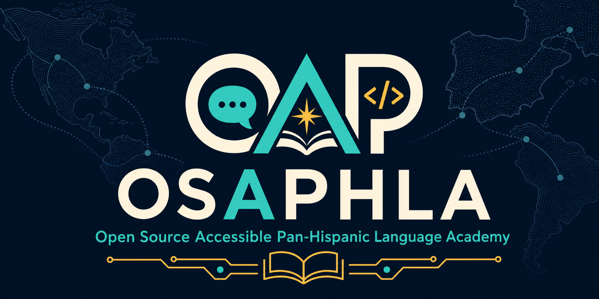

# Open Source Accessible Pan-Hispanic Language Academy (OSAPHLA)



An Open-Source, Accessible, & Pan-Hispanic Language Academy with bilingual lessons, vocabulary, readings, quizzes, and narrated videos for learning Spanish.

OSAPHLA is a private, offline-first Spanish course containing **36 weeks, 180 assessed sections,
4,320 question-bank items, and 88 reading activities**. It targets an ILR 2
core with ILR 2+/2+/2 stretch preparation; it does not claim to award an official
ILR rating.

The course is a single-user PWA. All settings, attempts, recordings, and progress
stay in the browser. There is no account system, telemetry, advertising, remote
database, or required runtime API.

## Try the Demo

A working demo can be found at https://w3b.cryptojones.dev/OSAPHLA/

## Start the academy

Install a current Node.js LTS release, then open a terminal in this repository.

### macOS

```bash
npm install
npm run start:local
```

### Windows (PowerShell)

```powershell
npm install
npm run start:local
```

### Linux

```bash
npm install
npm run start:local
```

`npm run start:local` prompts for a port, remembers that preference in your operating
system's user configuration directory, verifies the port is available, starts Vite,
and opens the resulting URL in Firefox when Firefox is installed. Pass a port without
the prompt using `npm run start:local -- --port 5180`. Stop the server with `Ctrl+C`.
On later runs, press Enter to reuse the remembered port. The lower-level `npm run dev`
command remains available when automatic port selection is preferable.

The first screen is a visual-comfort lab. It offers
system, high-contrast dark, high-contrast light, low-glare charcoal, warm paper,
and monochrome themes plus independent typography, spacing, reading-width, focus,
cursor, density, and motion controls.

Create a production PWA with `npm run build`, then preview it with
`npm run preview`. The app shell and authored course work offline after the first
load. Week media and the optional speech model use separate browser caches so they
can be managed without erasing progress. The Display page includes a one-button
offline media installer for all 180 videos and narration tracks.

## Instruction and assessment

Every section includes:

- themeable semantic slides with optional local narration;
- a descriptive transcript and an optional rendered MP4;
- objectives, instruction, vocabulary, model sentences, and a productive task;
- an on-device microphone lab with optional local Whisper transcription;
- a 24-item bank: eight multiple choice, eight cloze, and eight ordering items;
- a randomized twelve-item attempt with four items of each type and an 85% target.

Ordering works through ordinary buttons and dedicated left/right controls, so drag
precision is never required. Early cloze work warns about missing accents; later
work requires them. Regional accepted forms are explicit rather than fuzzily graded.

## Local media rendering

The adaptive HTML presentation is the authoritative, fully themeable instruction.
Optional MP4 copies use the same slide data and descriptive text:

```bash
npm run render:media -- --section w01-briefing
npm run render:media -- --kind input --force --jobs 3
npm run render:media -- --theme low-glare
npm run render:media -- --force --jobs 3
```

The second command renders every section and safely skips completed files. Add
`--force` to rebuild, and use `--jobs 1` through `--jobs 4` to control parallel
local rendering. Rendered media lives under `public/media/` and is ignored by
Git because it is reproducible and large. The renderer uses the local Kokoro
neural model, Chrome, and FFmpeg, creates captions and transcripts, and accepts any
supported visual theme. Narration follows a deterministic, balanced rotation:
original Dora, younger Dora Y1, younger Dora Y3, original Santa, and Dora/Santa E
each narrate 36 lessons. Each lesson keeps its assigned voice across rerenders.
English and Spanish use the same assigned voice profile with phoneme-level `en-us`
and `es-419` code-switching. Spanish terms inside English instruction retain Latin
American pronunciation (for example, `usted` is routed as `ustˈed`, never through
the English phonemizer). The generated Kokoro audio powers the MP4, adaptive slide
narration, and vocabulary pronunciation controls; browser system TTS is not used
for normal lesson playback.

Set `KOKORO_PYTHON` and `KOKORO_MODEL_DIR` when the existing courseware environment
is not installed in its usual location. Python dependencies are pinned in
`requirements-tts.txt`.

After a full render, run `npm run media:validate` to verify every section's video,
adaptive slide audio, vocabulary audio, captions, transcript, balanced narrator
assignment, encoding, and phoneme-level pronunciation audit.

## Quality gates

```bash
npm run curriculum:validate
npm test
npm run build
npm run test:e2e
# or all four:
npm run qa
```

The automated gates verify the complete curriculum contract, balanced assessments,
production build, first-run accessibility, WCAG scanning, and
320-pixel reflow. See `docs/ACCESSIBILITY.md` and `docs/CURRICULUM.md` for the
behavioral specification.

---

*Proudly Made in Nebraska. Go Big Red! 🌽 <https://xkcd.com/2347/>*
